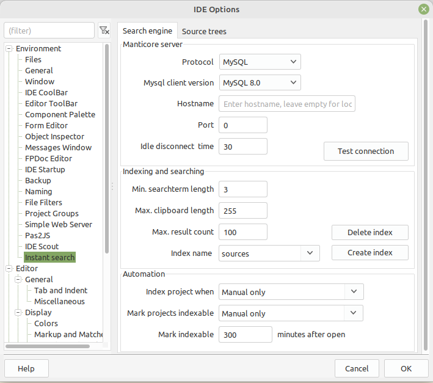
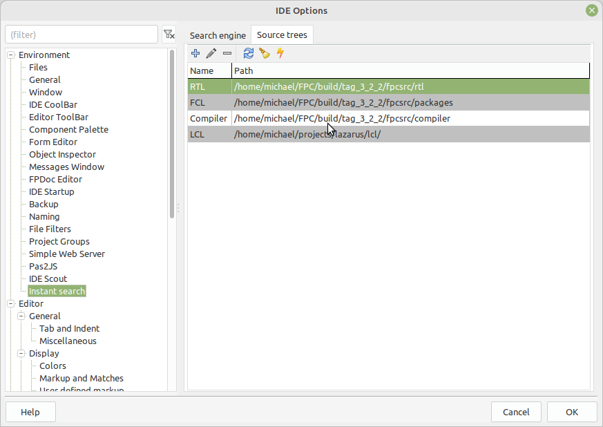
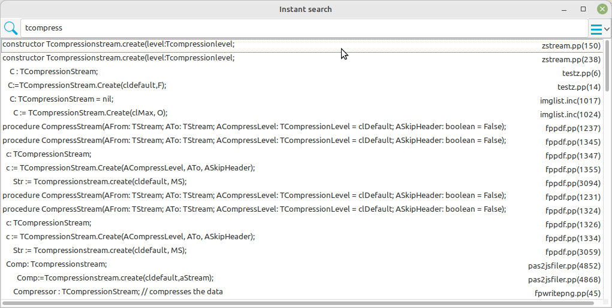

# Lazarus InstantSearch Package

# Intro
This directory contains the instantsearch package.

It provides an as-you-type search mechanism. 
See the 'View - Instantsearch' menu item (or CTRL-ALT-F).

It uses [Manticore Search](https://manticoresearch.com/) to provide the
search capabilities. Manticore search creates an index of the source files,
which it then uses to provide you with search capabilities.

## Installation

### Install manticoresearch

Before you can use Lazarus InstantSearch, you must have Manticore Search
installed. It can be installed locally, or on another computer.

To install Manticore search, please see the  instructions at 
[https://manual.manticoresearch.com/Installation](https://manual.manticoresearch.com/Installation).

### Install instantsearch

Using the package menu, install the *lazinstantsearch* package.
You will need to recompile the IDE.

### Configure instantsearch.

After installing the package, before you can use instantsearch, it needs to be configured: 
at least the location of the manticore search engine must be specified.

Using Tools - options, select the 'Instant Search' item under the Environment
option group.

## Configuration
The configuration is done using the 'Instant Search' item under the Environment option group.

 
You must configure at least the following things:
* Protocol - MySQL or HTTP
* MySQL Client version - if you selected the MySQL protocol.

You can leave hostname and port empty if you installed on the local machine
using the default settings.

Test the connection with the 'Test connection' button.

If the connection is OK, set the index name to use, and use the 'Create
Index' button to create the table used to store the search index.

if the index already exists, you will be warned about this.

When the index has been created (or was already created), 
the configuration dialog will check which source trees exist (normally
none), and will offer to start indexing. This is done in the background.

### Configuring source trees

By default, InstantSearch configures 4 source trees:
* RTL : The RTL sources of FPC.
* FCL : The packages sources of FPC.
* Compiler : The FPC compiler sources 
* LCL : The lazarus LCL sources.

You can define as much search trees as you want, using  the buttons in the toolbar.
You can use the buttons to refresh the indexes of a source tree.

Note: when you change the source directory of FPC or rescan it, 
the RTL/FCL/Compiler trees will be re-indexed.

The  4 trees are configured and indexed automatically, a message will appear
in the messages window when this happens.

### Indexing the current (active) project.
The sources of the current project can also be searched, provided it has
been indexed. This is a 2-step process:

* Mark a project as indexable. This can be done using the ``Mark project as indexable``
popup menu item in the project inspector, or below the 'Project' menu in the
main menu. 

* Actually index the project. The project is automatically indexed when you
mark it as indexable. 
   You can manually index a project at any time using the project menu item in the main menu, 
   or the popup item. 

## Searching
To search, open the 'Instant search' window under 'View' (or press CTRL-Alt-F)

If Instant Search was not yot configured, you will get a warning and the IDE
will offer to open the configuration dialog.

The dialog will automaticall copy the selection (provided it is not too big and does not contain cr/lf characters) 
to the search edit box and do a search with that. 

You can type in the search edit box at the top.
As you type, the search results will be more refined or expanded.

Each match is displayed with the line contents, and the filename+lineno.

Double click one of the lines to open the file at the selected location.

If you have too many matches, you can check or uncheck some of the source
trees in the top-right search bar.

## More help
Can be found in the [WIKI](https://wiki.freepascal.org/Lazarus_InstantSearch)